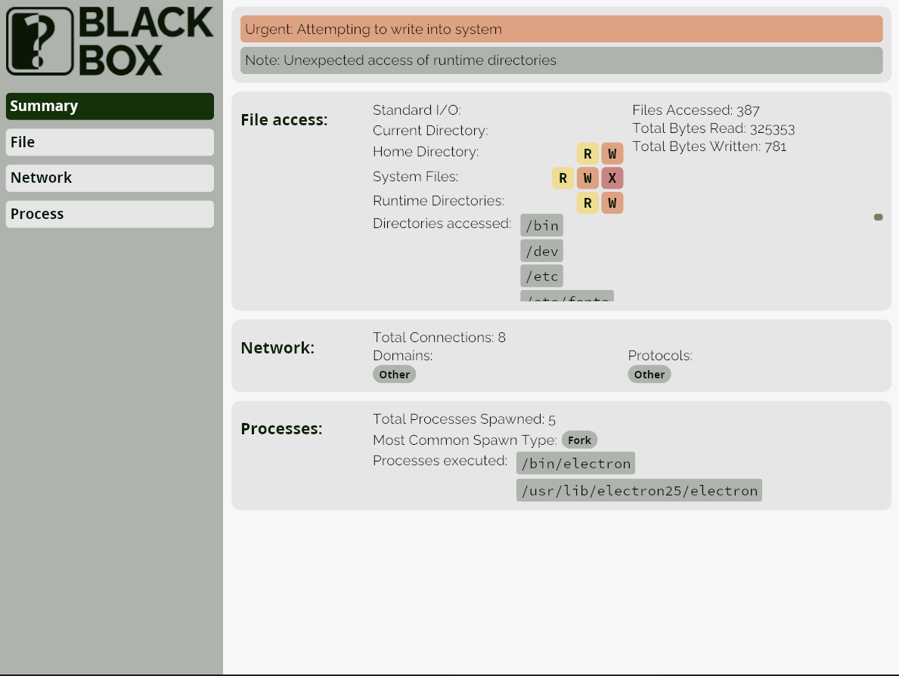

<div style="margin:auto;width:max-content;">


</div>

# Blackbox

Blackbox is an eBPF-based process tracing and analysis program for Linux.

<div style="margin:auto;width:max-content;max-width:100%">



</div>

## Building

### Prerequisites

1. Linux; eBPF is not supported on Windows or MacOS. Additionally, a kernel from within the past few years is required.
   - Note: eBPF may not be en in some virtual machines
   - Note: the iced GUI library requires certain support in graphics drivers for displaying images. Insufficient drivers may cause the Blackbox logo to display as a solid black box in the UI.
2. A rust compiler - install with [Rustup](https://rustup.rs/)
3. The bpf-linker: `cargo install bpf-linker`

### Compilation

```bash
# compile the ebpf program
cargo xtask build-ebpf

# compile the user-space program
cargo build
```

To perform an optimized release build you can add the `--release` flag to both commands. After compiling both programs, the executable will be located in `target/release/blackbox` or `target/debug/blackbox`, depending on whether release mode has been specified.

## Usage

Because eBPF tracing is a privileged operation, Blackbox is designed to be run as root.
It requires a "user" argument which specifies the user permissions under which the traced
command should be run.

```bash
# print options
./target/release/blackbox --help
# or if blackbox was compiled without --release
./target/debug/blackbox

# -E is used to preserve the environment (e.g. env variables).
# If this is not important for the program being run,
# it can be omitted
sudo -E ./target/release/blackbox --command "<COMMAND>" --user $USER
```

## Testing

Tests are located in the `tests` directory. The `features` test can be run with `make` and `blackbox --command "./main" ...`. The flags tests can be run by executing them directly with Blackbox:

```bash
sudo -E ./target/release/blackbox --command "./tests/flags/installer.py" --user $USER
```

The `profile_vs_strace.sh` and `test_strace_parity.sh` scripts are self-contained, and should be executed from their local directory.

## Development

```bash
# For development, blackbox should be run through cargo.
# The RUST_LOG environment variable specifies the
# logging level to run under
RUST_LOG=info cargo xtask run

# for only Blackbox debug logs
RUST_LOG=blackbox=debug,warn cargo xtask run
```
